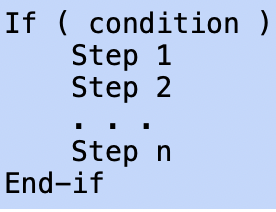

# Chapter 1 Logic
## Propositions and logical operations

Proposition: 命题

Compound Proposition, logical operation.

$p\wedge q$: conjunction, 与命题

$p\vee q$: disjunction, 或命题, inclusive or

$p\oplus q$: exclusive or, 异或命题，

## Evaluaing compound proposition

$\neg$ not, 

$\wedge$ and, 

$\vee$ or.

## Conditional Statements

$p\rightarrow q$ conditional operation. $p$: hypothesis, $q$: conclusion. 如果假设错误，那么真值表永远正确.

converse, 逆命题, $q\rightarrow p$

contrapositive, 逆否命题 $\neg q\rightarrow\neq p$

inverse, 否命题, $\neg p\rightarrow \neg q$

$p\leftrightarrow q$ biconditional operation, iff, 只有p和q同时真时结果为真

## Logical equivalence

A compound proposition is a tautology if the proposition is always true. e.g. $p\vee\neg p$.

A compound proposition is a contradiction if the proposition is always false. e.g. $p\wedge\neg p$.

Two compound propositions are logically equivalent if they have the same truth value. $p=\neg\neg p$. Two propositions are logically equivalent iff $s\leftrightarrow r$ is a tautology.

## Laws of propositional logic

| Name   |                       |                       |
| ----------- | ----------- | ----------- |
| Idempotent Laws    | $p\vee p=p$                      | $p\wedge p=p$                            |
| Associateive Laws  | $(p\vee q)\vee r=p\vee(q\vee r)$ | $(p\wedge q)\wedge r=p\wedge(q\wedge r)$ |
| Commutative Laws   | $p\vee q=q\vee p$ | $p\wedge q=q\wedge p$ |
| Distributive Laws | $p\vee (q\wedge r)=(p\vee q)\wedge (p\vee r)$| $p\wedge (q\vee r)=(p\wedge q)\vee (p\wedge r)$|
| Complement Laws | $p\wedge \neg p=F$ | $p\vee\neg p=T$ |
| De Morgan's Laws | $\neg(p\vee q)=(\neg p\wedge \neg q)$ | $\neg (p\wedge q)=(\neg p\wedge \neg q)$ |
| Absorption Laws | $(p\vee (p\wedge q)=p$ | $p\wedge (p\vee q)=p$ |
| Conditional Identities | $p\rightarrow q=\neg p\vee q$ | $p\leftrightarrow q=(p\rightarrow q)\wedge (q\rightarrow p)$|

## Predicates and quantifiers

Predicate: 断言, $P(x)$: P of x. Domain

Quantifier

Universal quantifier: $\forall. \forall x P(x)$: universally quantified statement. Counterexample.

Existential quantifier: $\exists. \exists x P(x)$: existentially quantified statement. Example.

## Quantified statements

The universal and existential quantifiers are generically called **quantifiers**. A logical statement that includes a universal or existential quantifier is called a **quantified statement**.

A variable $x$ in the predicate $P(x)$ is called a **free variable** because the variable is free to take on any value in the domain.The variable $x$ in the statement $\forall x P(x)$ is a **bound variable** because the variable is bound to a quantifier.

## De Morgan's law for quantified statements

$$\neg\forall x P(x)\equiv \exists x\neg P(x)$$

$$\neg\exists x P(x)\equiv \forall x\neg P(x)$$

## Nested quantifiers

If a predicate has more than one variable, each variable must be bound by a separate quantifier. A logical expression with more than one quantifier that bind different variables in the same predicate is said to have nested quantifiers. The examples below show several logical expressions and which variables are bound in each. The logical expression is a proposition if all the variables are bound.

De Morgan's law with nested quantifiers

## More nested quantified statements

Operation $\neq $

Uniqueness 

Moving quantifiers in logical statements

## Logical reasoning

**Argument**: hypotheses + conclusion.

An argument is **valid** if the conclusion is true whenever the hypotheses are all true, otherwise the argument is **invalid**.

This argument is valid whenever the proposition $(p_1\wedge p_2\wedge \cdots \wedge p_n)\rightarrow c$ is a tautology.

## Rules of inference with propositions

inference: 推理

The validity of an argument can be established by applying the rules of inference and laws of propositional logic in a **logical proof**.

## Rules of inference with quantifiers

The rules **existential instantiation** and *8universal instantiation** replace a quantified variable with an element of the domain. The rules **existential generalization** and **universal generalization** replace an element of the domain with a quantified variable. Note that the rules only apply to non-nested quantifiers. Applying the rules of inference to nested quantifiers would require more constraints on which rules could be applied in particular situations.

# Chapter 2 Proofs

## Mathematical definitions

Even and odd integers. The **partity** of a number is whether the number is odd or even: same parity, opposite parity.

Rational number.

Divides: an integer $x$ **divides** an integer $y$ iff $x\neq 0$ and $y=kx$ for some integer $k$. We denote $x\div y$. If $x$ does not divide $y$, then $x\not\div y$.

If $x$ divides $y$, then $y$ is said to be a **multiple** of $x$, and $x$ is a **factor** or **divisor** of $y$.

Prime and composite numbers

Inequality. 

## Introduction to proofs

Perfect squre $n=k^2$.

Consecutive: $n,n+1$

Universal or existential statements

Proofs of universal statements: proofs by exhaustion. 枚举法

Proofs of universal statements: universal generalization. 去定元素，证明结论

Counterexamples

Counterexamples for conditional statements

Proving existential statements (existence proof)

A constructive proof of existence gives a specific example of an element in the domain or a set of directions to construct an element in the domain that has the required properties.

A nonconstructive proof of existence proves that an element with the required properties exists without giving a specific example. A common method for giving a nonconstructive existence proof is to show that the non-existence of an element with the required properties leads to a contradiction.

Disproving existential statements: show every objects does not have the required properties (via De Morgan's law)

## Writing proofs: best practices and common errors in proofs

Common mistakes: generalizing from examples, skipping steps, **circular reasoning**(循环论证), assuming facts that have not yet been proven.

## Writing direct proofs

## Proof by contrapositive

证明逆否命题

direct proof vs proof by contrapositive: 看条件和结论哪个更好用

Proofs by contrapositive of conditional statements with multiple hypotheses: 假设结论错误，证明其中一个条件错误，或者假设结论错误，除了某条件都正确，证明该条件错误

## Proof by contradiction

又称 indirect proof

Without loss of generality: 不同情况的证明过于相似而重复。

## Proof by cases

each class: case

# Chapter 3 Sets

## Sets and subsets

roster notation 列举法

natural number: 0,1,2,3,...

universal set, Venn diagrams

## Sets of sets

power set $P(A)$.

## Union and interesction

## More set operations

Difference $A-B$.

Symmetric difference $A\oplus B$.

Complement $\overline{A}$.

## Set identities

## Cartesian products

**Ordered pair** $(x,y)$, first **entry**, second entry.

Ordered triple, ordered n-tuple.

**Strings** If A is a set of symbols or characters, the elements in An can be written without the usual punctuation (parentheses and commas) used for ordered n-tuples. A sequence of characters is called a **string**. The set of characters used in a set of strings is called the **alphabet** for the set of strings. The **length** of a string is the number of characters in the string. 

A **binary string** is a string whose alphabet is $\{0,1\}$. A **bit** is a character in a binary string. A string of length n is also called an **n-bit string**. **Concatenation** of two strings, empty string.

## Partitions

Disjoint, partition.

# Chapter 4 Functions

## Definition of functions

Domain, target (co-domain)

Arrow diagram if domain is finite sets.

Range

## Floor and ceiling functions

Floor function: 不大于x的最大整数

Ceiling function: 不小于x的最小整数

## Properties of functions

one-to-one injective

onto surjective

bijective, bijection, one-to-one correspondence

## The inverse of a function

## Composition of functions

## Logarithms and exponents

$b^x$: b: base of the exponent, x: exponent.

$\log_b(x)$, b: base of the logarithm

# Boolean Algebra

## An inratroduction to Boolean algebra

Boolean addition: $1+1=1$. 对应 $T\vee T=T$, 其他都是正常的运算.

## Boolean functions

## Disjunctive and conjunctive normal form

Disjunctive normal form (DNF): 

Conjunctive normal form (CNF):

clause: 分句

## Functional completeness

Here is a method to express an arbitrary Boolean function using only multiplication and complement operations:

Start with the input/output table for the function.

Find a DNF expression that is equivalent to the function.

Repeatedly apply De Morgan's law to eliminate each addition operation.

如果使用 NAND 或者 NOR，我们可以只用一个operation来描述所有的expression

## Boolean satisfiability

The Boolean satisfiability problem (called SAT for short): 看函数能不能取到1

If there is a way to set the input variables that causes a Boolean expression to evaluate to 1, then the expression is said to be satisfiable. Otherwise, the expression is unsatisfiable. A particular assignment of values to the variables satisfies a Boolean expression if the assignment causes the expression to evaluate to 1.

转换成 DNF 和 CNF 之后可以更系统的了解是否满足。

课程安排问题：

## Gates and circuits

门与电路
gate:门，circuits：电路

# Relations/Digraphs

## Introduciton to binary relations

self-loop

## Properties of binary relations

Refiexive: 自反, anti-reflexive: 没有任何自反

Symmetric, anti-symmetric,

Transitive

## Directed graphs, paths, and cycles

Walk, length of a walk, open walk, closed walk.

A trail is an open walk in which no edge occurs more than once.
没有边重复

A circuit is a closed walk in which no edge occurs more than once.
没有边重复

A path is a trail in which no vertex occurs more than once.
没有顶点重复

A cycle is a circuit of length at least 1 in which no vertex occurs more than once, except the first and last vertices which are the same.
除了自己外没有顶点重复

## Composition of relations

## Graph powers and the transitive closure

$R$ -> $R^k$, kth power of G

## Matrix multiplication and graph powers

## Partial orders

partially ordered set, poset: reflexive, transitive and anti-symmeetric
偏序集

## Strict orders and directed acyclic graphs

strict order: transitive and anti-reflexive

comparable, incomparable.

Total order, minimal, maximal

A **directed acyclic graph** or (DAG) is a directed graph that has no cycles.

## Equivalence relations

reflexive, symmetric and transitive

equivalent class, partition.

## N-ary relations and relational datebases

# Computation

## An introduction to algorithms

A description of an algorithm usually includes:

A name for the algorithm
A brief description of the task performed by the algorithm
A description of the input
A description of the output
A sequence of steps to follow

An important type of step in an algorithm is an **assignment**, in which a variable is given a value.

The output of an algorithm is specified by a **return** statement.

**If-statement**

**If-else-statement**

**For-loop**

For ... to ...: index. Iteration

**While-loop**

**Nested loop**

## Asymptotic growth of functions

## Analysis of algorithms

## Finite state machines

## Turing machines

## Decision problems and languages

# Induction and Recursion

## Sequences

Term, index

initial index, final index, initial term, final term, infinite sequence, explicit formula

geometric sequencve, common ratio

arithmetic sequence, common difference

## Recurrence relations

recurrence relation: 迭代关系

Fibonacci sequence

Discrete time dynamical system

## Summations

summation notation, index, lower limit, upper limit

summation form: 求和形式

expanded form: 展开形式

closed form: 直接把求和算出来

## Mathematical induction

base case

inductive step

principle of mathematical induction

inductive hypothesis

## More inductive proofs

Divisibility proof by induction

Using induction to prove an assertion about a recurrence relation

inductive proofs showing the closed forms for sums of arithmetic and geometric sequences

An inductive proof for set operations

## Strong induction and well-ordering

## Loop invariants

## Recursive definition

## Structual induction

## Recursive algorithms

## Induction and recursive algorithms

## Analyzing the time complexity of recursive algorithmes

## Dive-and-conquer algotithms: introduction and mergesort

## Solving linear homogeneous recurrence relations

## Solving linear non-homogeneous recurrence relations

## Divide-and-conquer recurrence relations