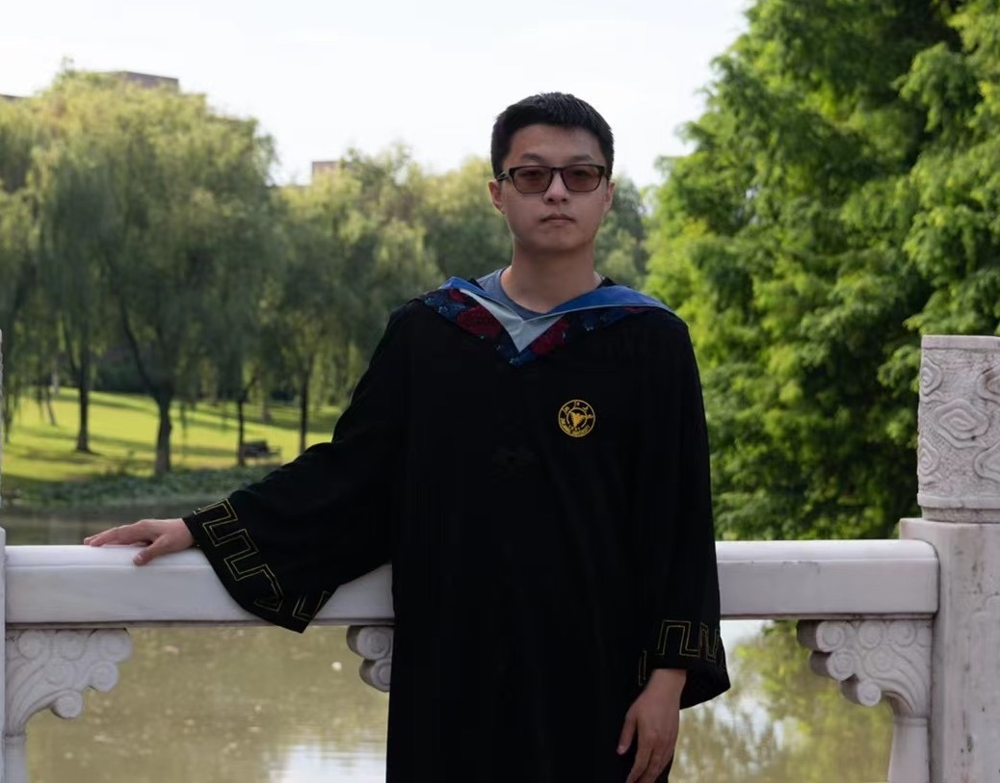

# Yu LUO

## About me

My name is Yu LUO, you can call me Joey. 
I'm a second year math graduate student at UW-Madison. Before that, I finish my undergraduate in Zhejiang University.  
**E-mail:** yluo237@wisc.edu  
**Office:** Room 518 Van Vleck Hall  
My research interest lies in arithmetic algebraic geometry.

Here is my [Curriculum Vitae](cv/yuluo_cv.pdf)

## Research

Comming in the future.

## Notes

Under construction

## More Information
 [Seminar Talks](Talks.md) 
 [Services](Services.md) 
 [Teaching](Teach.md) 

## [2022 Summer Math/CS 240 Discrete Math](2022_Summer/2022_Summer.md)

This page is still under construction.